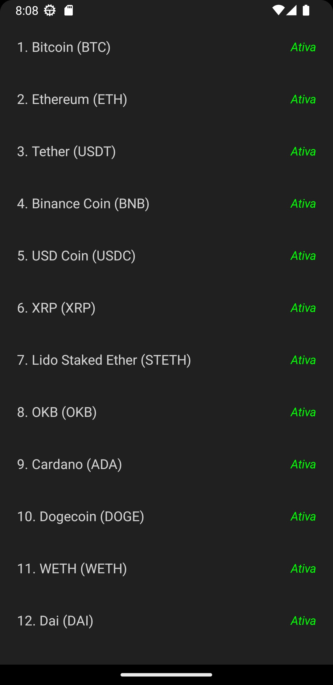
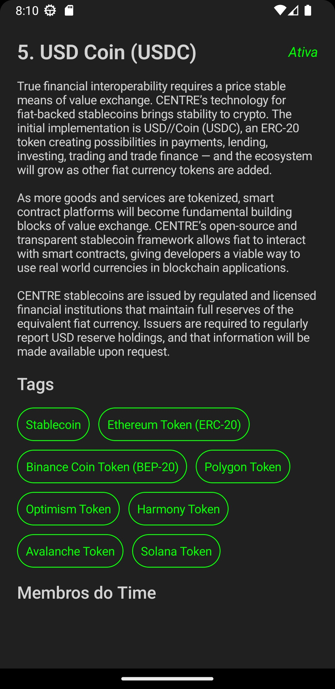
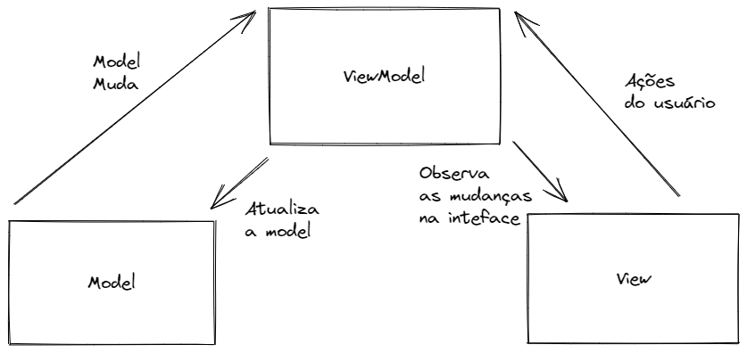

<h1 align="center">CryptoMoedas MVVM + JetPack</h1>

<p align="center">
<a href="https://opensource.org/licenses/Apache-2.0"></a>
 <a href="https://android-arsenal.com/api?level=21"></a>
  <br>
  <a href="https://wa.me/+5538999408433"></a>
  <a href="https://www.linkedin.com/in/carlos-souzapadilha/"></a>
  <a href="carlospadilhadev@gmail.com"></a>
</p>

<p align="center">  

⭐ Aplicativo com listagem de cryptomoedas, a partir da API Coin Paprika. Informações técnicas abaixo
 
🎥 O aplicativo foi feito na arquitetura MVVM, Dagger-Hilt para injeção de dependências e JetPack Compose para a criação das interfaces.

</p>

</br>

<p float="left" align="center">


 
</p>

## Download

Faça o download da <a href="apk/criptomoedas.apk?raw=true">APK diretamente</a>. Você pode ver <a href="https://www.google.com/search?q=como+instalar+um+apk+no+android">aqui</a> como instalar uma APK no seu aparelho android.

## Tecnologias usadas e bibliotecas de código aberto

- Minimum SDK level: 21
- [Linguagem Kotlin](https://kotlinlang.org/)
- Jetpack 
  - Lifecycle: Observe os ciclos de vida do Android e manipule os estados da interface do usuário após as alterações do ciclo de vida.
  - ViewModel: Gerencia o detentor de dados relacionados à interface do usuário e o ciclo de vida. 
  - LazyColunm: Faz a listagem dinámica dos dado de entrada
  - NavController: Usado para gerir as trasições de tela

- Arquitetura 
  - MVVM (View - ViewModel - Model)
  - Comunicação da ViewModel com a Model através de Kotlin Flow
  - Repositories para abstração da comunidação com a camada de dados.
  
- Bibliotecas 
  - [Retrofit2 & OkHttp3](https://github.com/square/retrofit): Para realizar requisições seguindo o padrão HTTP.
  - [Dagger-Hilt](https://github.com/google/dagger): Para carregamento de imagens e cacheamento das mesmas.
 

## Arquitetura
**CryptoMoedas** utiliza a arquitetura MVVM e o padrão de Repositories, que segue as [recomendações oficiais do Google](https://developer.android.com/topic/architecture).
</br></br>

<br>

## API de terceiros
[Coin Paprika Api](https://api.coinpaprika.com/) Retorna os dados de varias cryptomoedas do mercado

## Features

### Feature 1


Mostra do funcionamento de listagem e descrição do projeto

# Licença


```xml
Copyright [2023] [Carlos Padilha]

   Licensed under the Apache License, Version 2.0 (the "License");
   you may not use this file except in compliance with the License.
   You may obtain a copy of the License at

     http://www.apache.org/licenses/LICENSE-2.0

   Unless required by applicable law or agreed to in writing, software
   distributed under the License is distributed on an "AS IS" BASIS,
   WITHOUT WARRANTIES OR CONDITIONS OF ANY KIND, either express or implied.
   See the License for the specific language governing permissions and
   limitations under the License.
```
